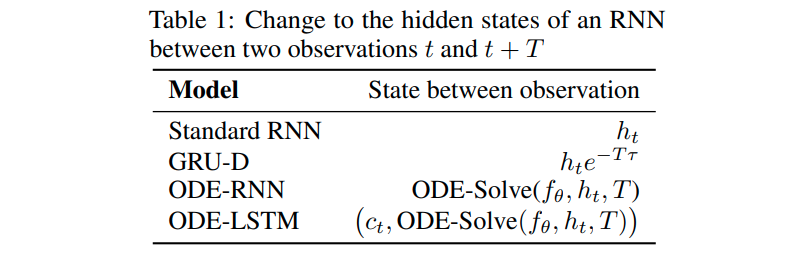

# Learning Long-Term Dependencies in Irregularly-Sampled Time Series

This is the official code repository of the paper *Learning Long-Term Dependencies in Irregularly-Sampled Time Series* [[arXiv link]](https://arxiv.org/pdf/2006.04418.pdf).

The principle idea of this paper is to combine ODE-RNNs with LSTM in a single architecture that 

- has the supreme modeling power of ordinary differential equations for fitting irregularly-sampled time series, and
- the capability of the LSTM architecture for learning long-term dependencies in the data.

Our proposed ODE-LSTM achieves this by post-processing the output-state of the LSTM's state-pair by a learnable ODE.  The LSTM's memory-state stays untouched to allow a near-constant backpropagation of the error signal. 



## Update January 2021 - PyTorch support added

Efficient and flexible **PyTorch** implementation added. 

Supports adaptive step-size solvers through the [TorchDyn](https://github.com/DiffEqML/torchdyn) package, 
as well as much faster but less precise custom implemented fixed-stepsize solvers.

The file [torch_node_cell.py](https://github.com/mlech26l/ode-lstms/blob/master/torch_node_cell.py) contains the implementation of the ODE-LSTM.
The file [pt_trainer.py](https://github.com/mlech26l/ode-lstms/blob/master/pt_trainer.py) uses [PyTorch-Lightning](https://github.com/PyTorchLightning/pytorch-lightning) to train a ODE-LSTM on some of the datasets of the paper.
In particular, the PyTorch implementation give lightly better results than the TensorFlow implemenation.

Here is a subset of the available solver types:
- ```dopri5``` Dormand-Prince adaptive stepsize solver using [TorchDyn](https://github.com/DiffEqML/torchdyn) package, 
- ```fixed_rk4``` Fixed-stepsize 4-th order Runge-Kutta 
- ```fixed_heun``` Fixed-stepsize Heun's method solver
- ```fixed_euler``` Fixed-stepsize explicit Euler method

Example usage

```bash
python3 pt_trainer.py --dataset person --solver fixed_rk4 --size 128 --epochs 50
```
Trains a ODE-LSTM of 128 units on the person activity dataset for 50 epochs.

**Why the fixed-stepsize solvers?**
Similar to the issue of the Dormand-Prince solver implementation of the TensorFlow-probability package, 
the adaptive-stepsize solvers of the  [TorchDyn](https://github.com/DiffEqML/torchdyn) and the [torchdiffeq](https://github.com/rtqichen/torchdiffeq)
only have limited support for requesting a batched solution time, i.e., each item of a batch may require a different solution time.

We implemented a workaround that simulates an entire batch at the union of the solution times in the batch, which may results in unnecessary computations.
The custom implementation of the fixed-stepsize solvers are implemented with full support of  batched solution times, thus are much faster (at the cost of lower numerical precision).


## Requirements

**Packages**
- Python 3.5 or newer
- TensorFlow 2.0 or newer
- (torch 1.7.1, torchdiffeq 0.1.1, torchdyn 0.2.2.1, torchsde 0.2.4)

Tested with python3.6/python3.5 and TensorFlow 2.1 on Ubuntu 18.04 and Ubuntu 16.04

## Data preparation

Data for the XOR experiment are generated *on the fly*, i.e., no manual downloading necessary.
The MNIST data are loaded through the ```tf.keras.datasets``` API, i.e., no manual downloading necessary.
Data for the Walker kinematic and the person activity task however, must be downloaded first. 
This can be done by 

```bash
source download_datasets.sh
```


## Module description

- ```node_cell.py```: Implementation of all continuous-time RNNs used in the experimental evaluation in the paper
- ```xor_task.py```: Executable to run the synthetic XOR experiment (both the dense and the event-based modes)
- ```person_activity.py```: Executable to run the Person activity experiment
- ```et_mnist.py```: Executable to run the Event-based sequential MNIST experiment
- ```walker_kinematic.py```: Executable to run the Walker2d kinematic simulation experiment

Each of the four executable python scripts contain the code for loading and pre-processing the data, as well the code to train and evaluate the models.

## Example usage

The four executable python scripts use some command line argument parsing to specify the RNN type and hyperparameters.
The RNN type can be specified by ```--model RNN```, where ```RNN``` is one of the following

| ```--model RNN``` | Description                           |
| ----------------- | ------------------------------------- |
| ```lstm```        | Augmented LSTM                        |
| ```ctrnn```       | CT-RNN                                |
| ```node```        | ODE-RNN                               |
| ```ctgru```       | CT-GRU                                |
| ```grud```        | GRU-D                                 |
| ```gruode```      | GRU-ODE                               |
| ```vanilla```     | Vanilla RNN with time-dependent decay |
| ```bidirect```    | Bidirectional RNN (LSTM with ODE-RNN) |
| ```phased```      | PhasedLSTM                            |
| ```hawk```        | Hawkes process LSTM                   |
| ```odelstm```     | ODE-LSTM (ours)                       |


For instance

```bash
python3 xor_task.py --model lstm --epochs 500 --dense
```

runs the XOR sequence classification experiment with the dense encoding (=regularly sampled time-series).
By omitting the ```--dense``` flag one can run the same experiment but with the event-based encoding (=irregularly sampled time-series)

## Logging

Each executable python script stores the result of the experiment in the directory ```results``` (which will be created if it does not exists).
The ```results``` directory will have the following structure:

- ```results/xor_event``` Results of the event-based XOR task
- ```results/xor_dense``` Results of the dense encoded XOR task
- ```results/smnist``` Results of the event-based sequential MNIST experiment
- ```results/person_activity``` Results of the Person activity dataset
- ```results/walker``` Results of the Walker2d kinematic simulation dataset

The results for different RNN types will be logged in separate files.
For instance, ```results/xor_event/lstm_64.csv``` will contain the results of the augmented LSTM with 64 hidden units on the event-based XOR task. The naming of the RNN models is the same as for the ```--model``` argument as described above.

## ODE solver choice

The following ODE solvers are available for running the ODE-RNNs:

- ```euler```: Fixed-stepsize explicit Euler's method
- ```heun```: Fixed-stepsize Heun's method
- ```rk4```: Fixed-stepsize 4th order Runge-Kutta
- ```dopri5```: Dormand and Prince adaptive stepsize solver

Choosing a fixed-stepsize solver also requires specifying the number of ODE solver steps unfoldings per RNN step.
It is recommended to use a fixed-stepsize solver, due to the much faster runtime.

The Dormand and Prince adaptive stepsize solver uses the ODE solver implemented in the TensorFlow Probability package. This implementation does not support to specify batched solution times. As this feature is vital for irregularly sampled time-series, we had to implement a workaround to support it. Therefore, choosing this ODE solving method simulates more than necessary, which reduces the computational efficiency. 

## Citation

```bibtex
@article{lechner2020longterm,
	title={Learning Long-Term Dependencies in Irregularly-Sampled Time Series},
	author={Lechner, Mathias and Hasani, Ramin},
	journal={arXiv preprint arXiv:2006.04418},
	year={2020}
}
```
